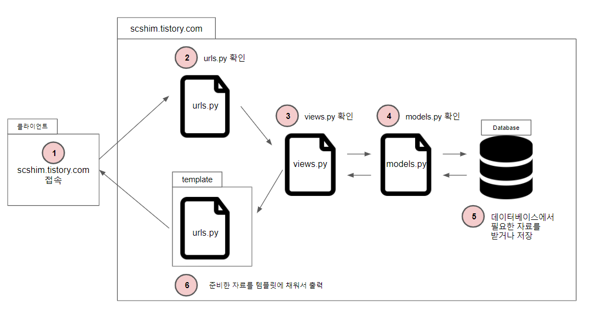

# django 작동구조

* 클라이언트(웹브라우저) : 요청 사항을 URL로 보냄
* urls.py : URL을 해석하여 지정된 함수를 호출 
  * 지정된 함수는 views.py에 정의되어 있음
* views.py : 함수내용이 정의되어 있음
  * 웹사이트의 동작 처리
* models.py : 데이터베이스 모델 정의, 데이터베이스 조회, 저장, 삭제, 변경 처리
* template을 통해 데이터베이스에서 가져온 정보를 담아서 클라이언트로 전송

## MTV 패턴

### M (model) : 자료의 형태 정의

### T (template) : 웹 페이지에서 출력할 모습을 정의

### V (view) : 어떤 자료를 어떤 동작으로 보여줄지 정의