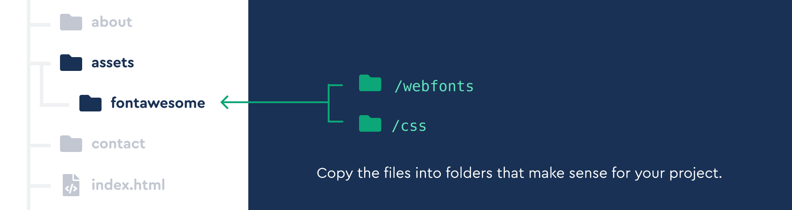

# Fontawesome

[TOC]

> Fontawesome의 아이콘은 CDN을 이용하지 않고, **폐쇄망 환경에서 사용이 가능**

## 

#### [Download the Font Awesome v6 files](https://fontawesome.com/download) and have them handy.





#### 사용범위

| Icon Style                                                   | Availability                              | Web Font Filename      | CSS Filename        |
| :----------------------------------------------------------- | :---------------------------------------- | :--------------------- | :------------------ |
| [Brands](https://fontawesome.com/search?f=brands)            | Free                                      | `fa-brands-400.*`      | `brands.css`        |
| [Solid](https://fontawesome.com/search?f=classic&s=solid&m=free) | Free                                      | `fa-solid-900.*`       | `solid.css`         |
| [Regular](https://fontawesome.com/search?f=classic&s=regular) | [Pro only](https://fontawesome.com/plans) | `fa-regular-400.*`     | `regular.css`       |
| [Light](https://fontawesome.com/search?f=classic&s=light)    | [Pro only](https://fontawesome.com/plans) | `fa-light-300.*`       | `light.css`         |
| [Thin](https://fontawesome.com/search?f=classic&s=thin)      | [Pro only](https://fontawesome.com/plans) | `fa-thin-100.*`        | `thin.css`          |
| [Duotone](https://fontawesome.com/search?f=classic&s=duotone) | [Pro only](https://fontawesome.com/plans) | `fa-duotone-900.*`     | `duotone.css`       |
| [Sharp Solid](https://fontawesome.com/search?f=sharp&s=solid) | [Pro only](https://fontawesome.com/plans) | `fa-sharp-solid-900.*` | `sharp-solid.css`   |
| [Sharp Regular](https://fontawesome.com/search?f=sharp&s=regular) | [Pro only](https://fontawesome.com/plans) | `fa-sharp-solid-400.*` | `sharp-regular.css` |

#### 스크립트 적용

```html
<head>
  <!-- our project just needs Font Awesome Solid + Brands -->
  <link href="/your-path-to-fontawesome/css/fontawesome.css" rel="stylesheet">
  <link href="/your-path-to-fontawesome/css/brands.css" rel="stylesheet">
  <link href="/your-path-to-fontawesome/css/solid.css" rel="stylesheet">
</head>
<body>
  <i class="fa-solid fa-user"></i>
  <!-- uses solid style -->
  <i class="fa-brands fa-github-square"></i>
  <!-- uses brand style -->
</body>

```

